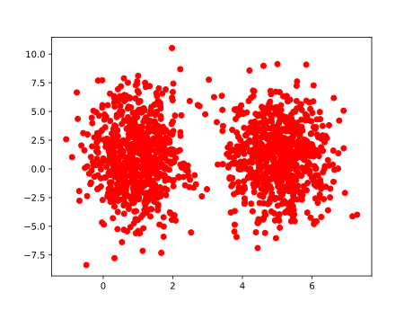
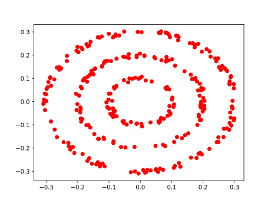

# PA3

<!-- you can modify the answering template freely -->
## Question 3.1(b)
Below is my experiment visualization result for applying kmeans to an unevenly distributed
Gaussian blobs, which is obtained by `python kmeans-experiment.py`.

The desired result is not the minimal value of the object function (or kmeans assumption on unit variance).

<!-- By detailed analysis I found ... -->

## Question 3.2(b)
Below is my experiment visualization result for applying spectral clustering to three circle
dataset, which is obtained by `python spectral-experiment.py`.

I think too big gamma reduces the accuracy because of floating-point computational issue. Small gamma also does not work well because of the dense property of the Laplacian matrix. That is, points from different clusters also have large similarity.